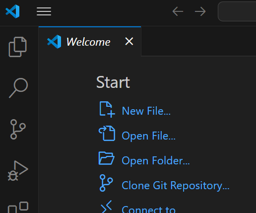
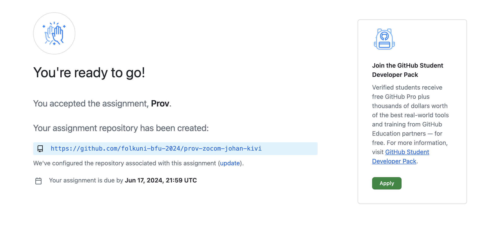
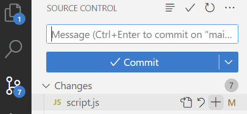
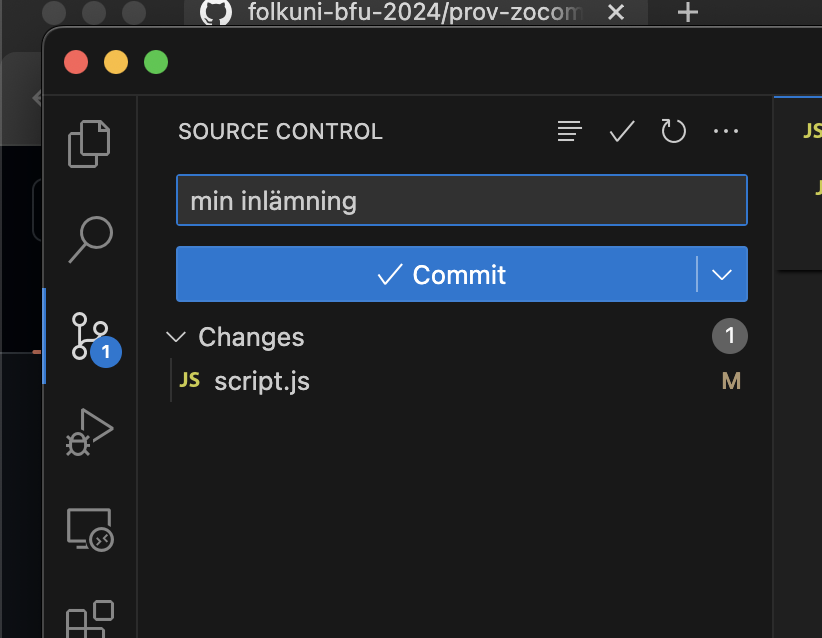
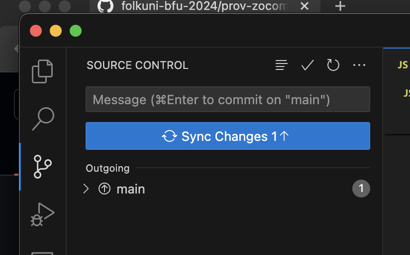
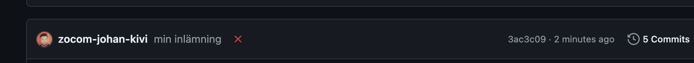
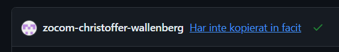

# Guide för inlämning

### 1
Starta provet! Starta VS Code och välj `Clone Git Repository` på Welcome-fliken. Välj en mapp på din dator som du ska ladda ner prov-koden till.

Om VS Code inte visar Welcome, utan ditt senaste projekt, måste du öppna ett nytt fönster. Klicka på menyn `File > New Window`.

Alternativ lösning om det inte fungerar med VS Code:
Installera [GitHub Desktop](https://desktop.github.com/) och klistra in URL:en. Då kan du ladda ner koden. Öppna den sedan med VS Code. När du är klar kan du ladda upp den från GitHub Desktop.

 

---

### 2
Använd "source control" fliken i Visual Studio Code för att ladda upp koden, när du är färdig.

Klicka på plus-knappen för att förbereda det du vill ladda upp. Som meddelande kan du till exempel skriva: "Completed assignment".

---

### 3
Klicka på "Commit" följt av "Sync Changes" för att spara och ladda upp din inlämning.

Efter att man laddat upp får man vänta en liten stund på att testen ska köras...

Medan du väntar, gå till kursens organisation på GitHub. Det ska finnas ett privat repo som heter: `kodprov-2024-ditt-namn`. Ganska snart ska det dyka upp antingen en grön bock eller ett rött kryss. Om du ser bocken är du godkänd!

Om du ser det röda krysset är du inte godkänd, och kan göra en ny inlämning, ända till deadline.

*Exempel: Christoffer är godkänd, men inte Johan.*

